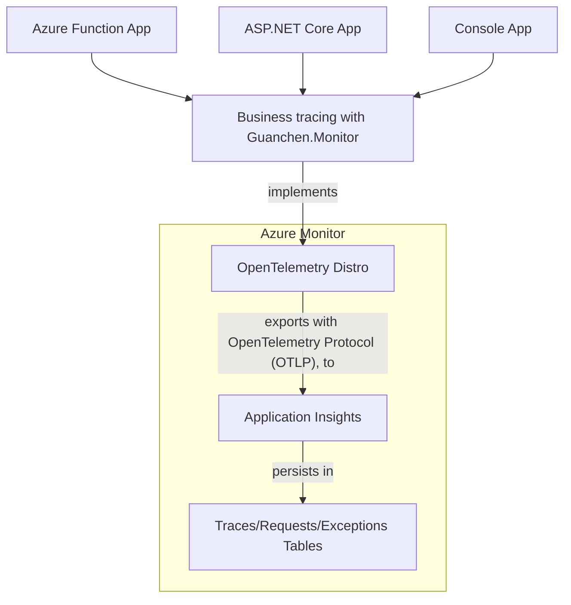
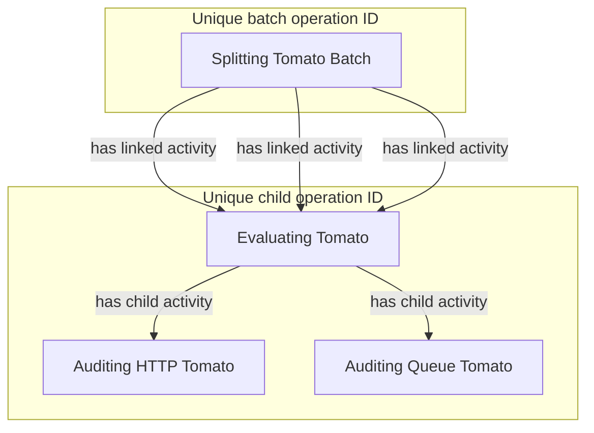
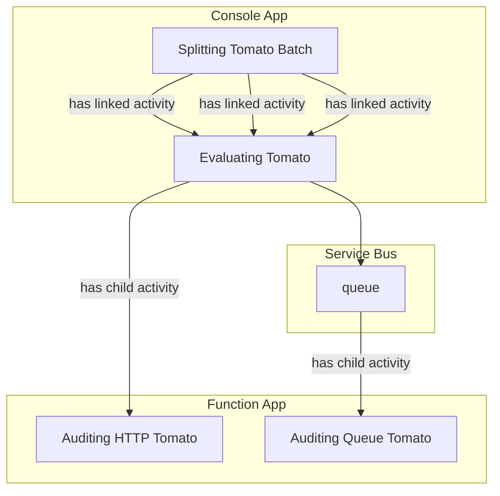
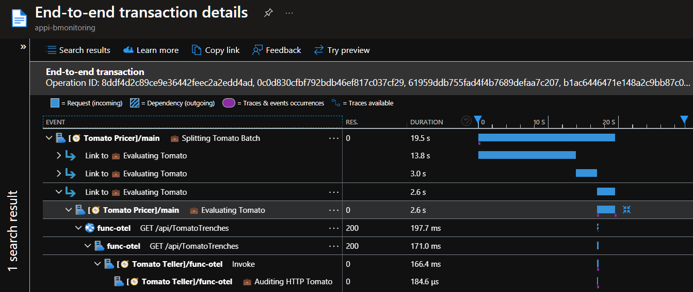
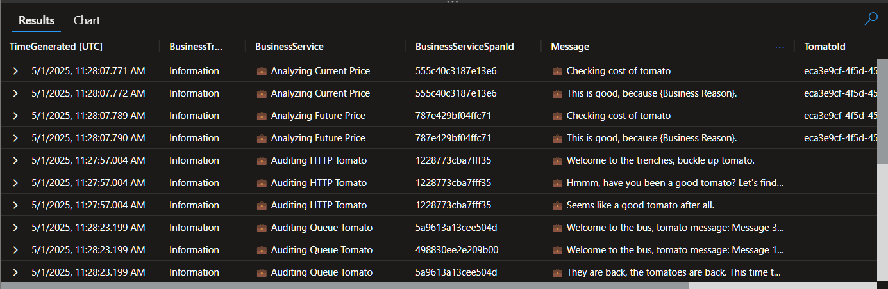

# Business tracing with OTel 💼

[![CC BY-NC-SA 4.0][cc-by-nc-sa-shield]][cc-by-nc-sa]


Get started with distributed business tracing in context of OTel (OpenTelemetry).

[Guanchen.Monitor](/Guanchen.Monitor/) is the component library to facilitate business tracing. Currently supported usages are:

1. Console Apps, sample via [IntegrationTest.Console](/IntegrationTest.Console/)
1. Function Apps, sample via [IntegrationTest.Function](/IntegrationTest.Function/)

## Library positioning

Business tracing in this project simply sits right between your app and the [Azure Monitor OpenTelemetry Distro](https://learn.microsoft.com/en-us/azure/azure-monitor/app/opentelemetry-enable?tabs=aspnetcore), as shown below:



## Usage

### Spans

> [OTel Spans](https://opentelemetry.io/docs/concepts/signals/traces/#spans) are [Activities in .NET](https://learn.microsoft.com/en-us/dotnet/api/system.diagnostics.activity) and end up in the `requests` table.

Use `StartParentBusinessActivity()` to start a business span and `StartLinkedBusinessActivity()` to start a business span linked to another span. Both of these methods generate new [operation IDs](https://learn.microsoft.com/en-us/azure/azure-monitor/app/data-model-complete#:~:text=operation_Id-,OperationId,-The%20unique%20identifier). These operation IDs are an important tool to analyze your business logging and can effectively seen as your span of business operations.

Use `StartChildBusinessActivity()` to start a child business span. This method will not generate a new operation ID and is generally suited for sub-processes within a business operation.

### Span Events

> [OTel Span Events](https://opentelemetry.io/docs/concepts/signals/traces/#span-events) are [ActivityEvents in .NET](https://learn.microsoft.com/en-us/dotnet/api/system.diagnostics.activityevent) and end up in the `traces` table.

Use `NewBusinessEvent()` to create business events within a span. These events are stored in the same table as [Logs](#logs) but are directly associated with a span, ensuring more reliable delivery. For more details, refer to the [Reliability notes](#reliability-notes).

### Logs

> [OTel Logs](https://opentelemetry.io/docs/concepts/signals/logs/) are [ILogger logs in .NET](https://learn.microsoft.com/en-us/dotnet/api/microsoft.extensions.logging.ilogger) and end up in the `traces` table.

Use `LogBusinessInformation()` or `LogBusinessError()` to create business logs within a span.

### Baggage

> [OTel Baggage](https://opentelemetry.io/docs/concepts/signals/baggage/) keeps contextual information and [propagates](https://opentelemetry.io/docs/concepts/context-propagation/#propagation) the information (which currently has its limits, as explained at [the Caveats paragraph](#caveats)). Technically, on .NET Activities they are `Tags` and for .NET ILogger logs they will be set on `OpenTelemetry.Logs.LogRecord.Attributes`. For both they will end up in the [Custom properties](https://learn.microsoft.com/en-us/azure/azure-monitor/app/data-model-complete#custom-properties-1) column of their related Azure Monitor table (`requests` and `traces` respectively).

Use `Baggage.SetBaggage()` to set business context information to the root span, this persists throughout other spans (and their logs and events) that use the same root span, unless overwritten by a more recent `Baggage.SetBaggage()`.

Use `yourActivity.SetBaggage()` to set business context information to an Activity, this persists throughout other child spans (and their logs and events).

This project makes sure that the baggage is continuously being set on business logs, business spans and business span events to make this information available in Azure Monitor.

Log, span and span event functions implicitly yield a `Business Trace` baggage key with the level (`Information`, `Error` etc.) als value.

## Integration tests

The integration test has the following OTel Span/Activity setup. There are 4 unique activities in total, 1 for the complete batch; `Splitting Tomato Batch`, and 3 for each tomato in the batch; `Evaluating Tomato`, `Auditing HTTP Tomato` and `Auditing Queue Tomato`. All activities are related to each other, either as link or as child.

In the following diagram the activities are related to the operation IDs:



In the following diagram the activities are related to the hosting resources:



### General prerequisites

Deploy and configure an Azure Service Bus with, as it's being used to send messages via the Console App to the Function App.

### IntegrationTest.Console prerequisites

For [IntegrationTest.Console](/IntegrationTest.Console/), prepare the following:

1. Set the Environment Variables on your machine:

    ```cmd
    setx APPLICATIONINSIGHTS_CONNECTION_STRING "InstrumentationKey=...;IngestionEndpoint=...;LiveEndpoint=...;ApplicationId=..."
    setx AZURE_TENANT_ID "..."
    setx AZURE_SERVICEBUS_FULLYQUALIFIEDNAMESPACE "....servicebus.windows.net"
    ```

1. Set the permissions for the identity running the Console App (likely yourself) on the Azure Service Bus to write messages.

### IntegrationTest.Function prerequisites

For [IntegrationTest.Function](/IntegrationTest.Function/), prepare the following:

1. Provision a Function App resource and deploy the Function App.
1. Set the permissions for the identity running the Function App (likely the Managed Identity) on the Azure Service Bus to read messages.
1. Configure the App Insights connection and the Service Bus connection (`ServiceBusConnection`). The environment variables inside your Function App resource should look similar to this:

    ```json
    [
        {
            "name": "APPLICATIONINSIGHTS_CONNECTION_STRING",
            "value": "InstrumentationKey=...;IngestionEndpoint=...;LiveEndpoint=...;ApplicationId=...",
            "slotSetting": false
        },
        {
            "name": "AzureWebJobsStorage",
            "value": "DefaultEndpointsProtocol=https;AccountName=...;AccountKey=...;EndpointSuffix=core.windows.net",
            "slotSetting": false
        },
        {
            "name": "DEPLOYMENT_STORAGE_CONNECTION_STRING",
            "value": "DefaultEndpointsProtocol=https;AccountName=...;AccountKey=...;EndpointSuffix=core.windows.net",
            "slotSetting": false
        },
        {
            "name": "ServiceBusConnection__credential",
            "value": "managedidentity",
            "slotSetting": false
        },
        {
            "name": "ServiceBusConnection__fullyQualifiedNamespace",
            "value": "....servicebus.windows.net",
            "slotSetting": false
        }
    ]
    ```

## Analyzing via Transaction view

Use [Transaction Diagnostics](https://learn.microsoft.com/en-us/azure/azure-monitor/app/transaction-search-and-diagnostics?tabs=transaction-diagnostics) to find the business traces and requests intertwined with the full technical diagnostics. It might look like this:



## Analyzing via query

Use a kql query to get all business information. It might look like this:



To replicate this query result, do the following:

Create [function](https://learn.microsoft.com/en-us/azure/azure-monitor/logs/cross-workspace-query#query-by-using-a-function) `AppRequestsTomatoScope` with all the distributed request tables:

```kql
union withsource= SourceApp
workspace("6d489906-8b6a-4eba-b697-373f29a1a98b").AppRequests
```

Create [function](https://learn.microsoft.com/en-us/azure/azure-monitor/logs/cross-workspace-query#query-by-using-a-function)  `AppTracesTomatoScope` with all the distributed trace tables:

```kql
union withsource= SourceApp
workspace("6d489906-8b6a-4eba-b697-373f29a1a98b").AppTraces
```

Run the following query to figure out what operation IDs are related to specific Tomato IDs:

```kql
let TomatoIds = dynamic([
    "1c946279-04b9-4c25-8846-0dabf1d59533"
]);
AppRequestsTomatoScope
| extend 
    TomatoId = tostring(Properties["Tomato ID"])
| where TomatoId in (TomatoIds)
| distinct OperationId, TomatoId
```

Run the following query to analyze specific operation IDs:

```kql
let OperationIds = dynamic([
    "db58273aca2e0e93a3ca4897a99ab36a"
]);
let Requests = AppRequestsTomatoScope
    | where OperationId in (OperationIds)
    | project BusinessServiceSpanId = Id, BusinessService = Name;
AppTracesTomatoScope
| where OperationId in (OperationIds)
| extend 
    BusinessTrace = tostring(Properties["Business Trace"]),
    TomatoId = tostring(Properties["Tomato ID"]),
    TomatoPartId = tostring(Properties["Tomato Part ID"])
| where isnotempty(BusinessTrace)
| project
    ParentId,
    TimeGenerated,
    BusinessTrace,
    Message,
    TomatoId,
    TomatoPartId
| join kind=leftouter (Requests) on $left.ParentId == $right.BusinessServiceSpanId
| project
    TimeGenerated,
    BusinessTrace,
    BusinessService,
    BusinessServiceSpanId,
    Message,
    TomatoId,
    TomatoPartId
| order by BusinessService asc, TimeGenerated asc
```

## Target tables

The following table mappings are relevant in this project:

| Azure Monitor Table | OpenTelemetry DataType | .NET Implementation
|---|---|---
| customMetrics        | Metrics                         | System.Diagnostics.Metrics.Meter
| exceptions           | Exceptions                      | System.Exception
| requests             | Spans (Server, Producer)        | System.Diagnostics.Activity
| traces               | Logs                            | Microsoft.Extensions.Logging.ILogger
| traces               | Span Events                     | System.Diagnostics.ActivityEvent

For a complete overview, see [How do Application Insights telemetry types map to OpenTelemetry?](https://learn.microsoft.com/en-us/azure/azure-monitor/app/opentelemetry-dotnet-migrate?tabs=aspnetcore#how-do-application-insights-telemetry-types-map-to-opentelemetry).

## Loglevel

### IntegrationTest.Console

`CreateLoggerFactory` contains `SetMinimumLevel`.  

### IntegrationTest.Function

`host.json` contains `logLevel.default`.

## Reliability notes

### Logs

> ❌ Using logs for auditing purposes is not supported.

**Eventual export of logs** to Azure Monitor is made possible by [Offline Storage and Automatic Retries](https://learn.microsoft.com/en-us/azure/azure-monitor/app/opentelemetry-configuration?tabs=net#offline-storage-and-automatic-retries), which are enabled by default in the [Azure Monitor OpenTelemetry Distro](https://learn.microsoft.com/en-us/azure/azure-monitor/app/opentelemetry-enable?tabs=aspnetcore), but [isn't a feature of the base .NET OpenTelemetry implementation yet](https://github.com/open-telemetry/opentelemetry-dotnet/issues/4115).

1. This doesn't reliably send messages again in case of a disaster at the client side, only when there is an outage at the Azure Monitor side.
1. Logs could be automatically converted to span events via `AttachLogsToActivityEvent` to get the same reliability as (events in) spans, but this changes the event message and properties too much and thus requires some more tweaking via `LogToActivityEventConversionOptions`.

### Spans

> ✔️ Using spans for auditing purposes is supported. This includes span events via `ActivityEvent`, added to (completed) spans via `Activity.AddEvent`.

**On time export of spans** to Azure Monitor is made possible by [ForceFlush](https://opentelemetry.io/docs/specs/otel/trace/sdk/#forceflush), implemented via `AutoFlushActivityProcessor`. This processor is in [OpenTelemetry.Extensions](https://www.nuget.org/packages/OpenTelemetry.Extensions).

1. To confirm that it reliably exports completed spans, please see the `FailFastTest` in [IntegrationTest](/IntegrationTest/).
1. See https://github.com/open-telemetry/opentelemetry-specification/issues/2944#issuecomment-1319536765 for more context.
1. It doesn't check the flush status but does wait until it's done, please see: https://github.com/open-telemetry/opentelemetry-dotnet-contrib/issues/2721.
1. [What is guaranteed on a completed Activity?](https://github.com/open-telemetry/opentelemetry-dotnet/discussions/6266)

## Caveats

1. Baggage is in a rough state, see:
   - Conflicting implementations: https://github.com/open-telemetry/opentelemetry-dotnet/issues/5667
   - Azure Function support not complete: https://github.com/Azure/azure-functions-host/issues/11026
   - Streamlining attempt in .NET: https://github.com/dotnet/runtime/issues/112803
   - Service Bus (messaging) support missing: https://github.com/Azure/azure-sdk/issues/6959
1. Creating new root traces is done via some (abstracted away) tricks in this project, learn more here https://github.com/open-telemetry/opentelemetry-dotnet/issues/984

## References

1. [OpenTelemetry .NET Logs](https://github.com/open-telemetry/opentelemetry-dotnet/tree/main/docs/logs#logger-management)
1. [OpenTelemetry .NET Contrib](https://github.com/open-telemetry/opentelemetry-dotnet-contrib)
1. [Go OTEL Audit](https://github.com/microsoft/go-otel-audit), a package for auditing Go code for Microsoft compliance purposes
1. [Audit.NET](https://github.com/thepirat000/Audit.NET)

## License

This work is licensed under a
[Creative Commons Attribution-NonCommercial-ShareAlike 4.0 International License][cc-by-nc-sa].

[![CC BY-NC-SA 4.0][cc-by-nc-sa-image]][cc-by-nc-sa]

[cc-by-nc-sa]: http://creativecommons.org/licenses/by-nc-sa/4.0/
[cc-by-nc-sa-image]: https://licensebuttons.net/l/by-nc-sa/4.0/88x31.png
[cc-by-nc-sa-shield]: https://img.shields.io/badge/License-CC%20BY--NC--SA%204.0-lightgrey.svg
